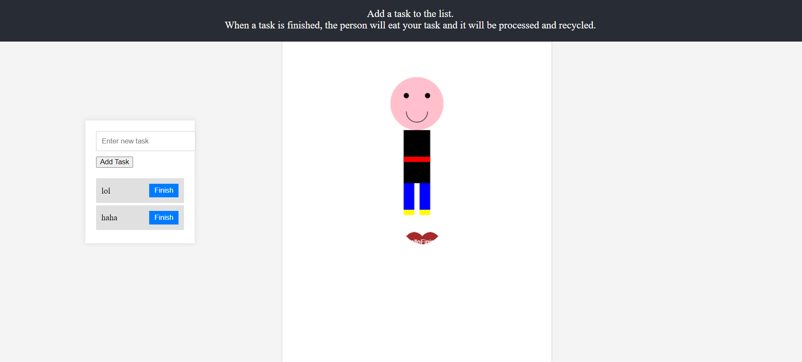

# To-Do List with JavaScript

This project is a fun and interactive to-do list application created using JavaScript. You can add tasks to the list, and when a task is finished, press the button to "feed" it to the animated person. The person will poop out the finished items.

## Features

- Add tasks to the to-do list.
- Mark tasks as finished and watch them animate towards the person.

## Motivation

Creating a to-do list might seem redundant with so many existing options like text editors, sticky notes, or even unconventional methods like your grandpa's adult diapers. So, I decided to make a more entertaining and visually appealing to-do list.

## Installation

1. Clone the repository:
   ```sh
   git clone https://github.com/feenix100/Styled_To_Do_List.git
   ```
2. Open the `index.html` file in your web browser.

3. Copy and paste code from `index.html` into a text editor and save as html. Open in browser.



## Usage

1. Enter a task in the input field and click "Add Task" to add it to the list.
2. When a task is completed, click the "Finish" button to feed it to the person.

Enjoy your interactive to-do list!
